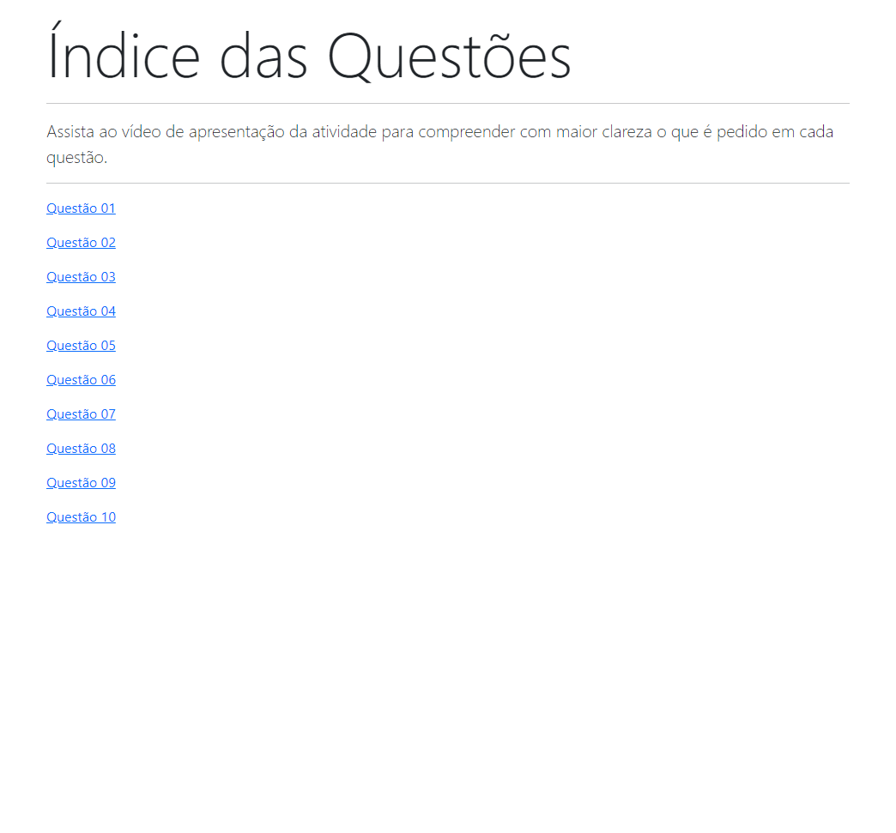

## Instituto Federal do Espírito Santo

# Bootstrap-5 Atividade Pratica da Semana-3
# https://mjpfelicia.github.io/Bootstrap-5-atividade-pratica-da-semana-3/

                 Welcome! 👋

## Índice

- Desafio
- Links
- Tecnologias usadas
- O que eu aprendi
- Recursos úteis
- Desafio
- layout ideal para a seção, dependendo do tamanho da tela

## Links usados:

- https://developer.mozilla.org/en-US/docs/Web/HTML/Element/form
- https://www.youtube.com/watch?v=YAT_lkd09XU&t=4s
- https://getbootstrap.com/docs/5.0/forms/overview/

## Tecnologias usadas:
- Marcação HTML5 semântica
- CSS

## O que eu aprendi

- Melhorando as habilidades no CSS
- Marcadores semânticos importantes - - para HTML
- Praticando para melhorar o - - design da página

## Autor
- @mjpfelicia
